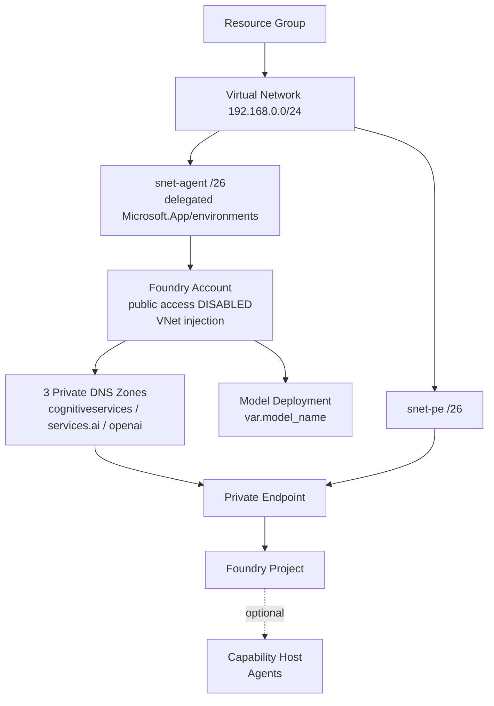

# Microsoft Foundry — Private Model Serving (East US 2)

## Purpose

Stands up a **network-isolated Microsoft Foundry** environment in **East US 2** and
deploys a **model** (chosen by name) that can be served/called privately from inside
a virtual network.

## Architecture

## Resources created (dependency order)

| # | Resource | What it does |
|---|----------|--------------|
| 1 | **Resource group** | Container for everything, in East US 2 (`local.location`, hardcoded) |
| 2 | **Virtual network** | `192.168.0.0/24` private network |
| 3 | **Agent subnet** (`/26`) | `192.168.0.0/26`, delegated to `Microsoft.App/environments` -> enables VNet injection for agents |
| 4 | **PE subnet** (`/26`) | `192.168.0.64/26`, hosts the private endpoint |
| 5 | **Foundry account** (`AIServices`) | The Foundry resource. Public access disabled, VNet-injected, system-assigned identity, project management + custom subdomain enabled |
| 6 | **3 private DNS zones + VNet links** | Resolve `*.cognitiveservices`, `*.services.ai`, `*.openai` to the private IP inside the VNet |
| 7 | **Private endpoint** | Gives the account a private IP in `snet-pe`; wires it to the DNS zones |
| 8 | **Foundry project** | Child of the account, with its own managed identity |
| 9 | **Model deployment** | Deploys the model named by `var.model_name` from the catalog (Kimi/DeepSeek/MiniMax/GPT/Anthropic) |
| 10 | **Capability host** *(optional)* | Only if `enable_agent_capability_host = true` — enables Foundry Agents |
| 11 | **Purge helper** *(destroy-time only)* | Waits ~15 min and purges the soft-deleted account so the delegated agent subnet can be deleted cleanly |

## Key behaviors

- **Region-locked** to East US 2 (not a variable).
- **Model is parameterized** — `terraform apply -var 'model_name=deepseek-r1'`. A catalog pre-fills format/version/SKU so only the name is passed. Re-applying with a new name **replaces** the current deployment.
- **Private-only access** — the model's data plane (inference) is reachable only from inside the VNet (VM/VPN/ExpressRoute). Terraform still manages everything because creation is control-plane (ARM), which isn't blocked.
- **Clean teardown** — `terraform destroy` intentionally pauses ~15 min due to the purge helper.

## File map

| File | Role |
|------|------|
| `providers.tf` | `azurerm`, `azapi`, `time` providers |
| `variables.tf` | All inputs (subscription, names, subnets, model, agent toggle) |
| `main.tf` | RG + VNet + subnets + Foundry account |
| `network.tf` | Private DNS zones + links + private endpoint |
| `project.tf` | Project + optional capability host |
| `models.tf` | Model catalog + parameterized deployment |
| `purge.tf` | Destroy-time subnet-unlock helper |
| `outputs.tf` | Endpoint, names, resolved model details |

## Out of scope

No ACR, no Application Insights/Log Analytics, no AMPLS/monitor DNS, and no BYO
Search/Storage/Cosmos. The account is VNet-only, so it assumes you have (or will add)
a way into the VNet (VM/VPN/ExpressRoute) to call the model.
