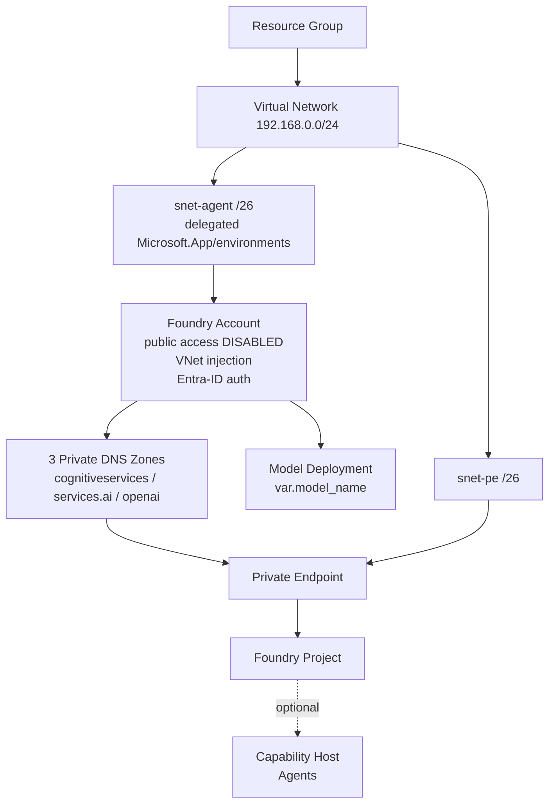

# Step-by-Step Implementation Guide

A complete walkthrough to deploy a **network-isolated Microsoft Foundry** environment on
Azure and serve a model — from zero to a working (private) deployment. No prior Terraform
experience required.

---

## 1. Overview

This Terraform configuration provisions, in **East US 2**:

- A **Microsoft Foundry (AI Services) account** with public network access **disabled**
- A **virtual network** with a delegated **agent subnet** and a **private-endpoint subnet** (both `/26`)
- A **private endpoint** + **private DNS zones** so the account resolves to a private IP inside the VNet
- A **Foundry project**
- A **model deployment** selected by name (e.g. `deepseek-v3`, `gpt-5`, `claude-opus`)
- An optional **agent capability host** (off by default)

Because public access is disabled, the model is only reachable from **inside the VNet**.

---

## 2. Architecture



| # | Resource | Purpose |
|---|----------|---------|
| 1 | Resource group | Container for all resources (East US 2) |
| 2 | Virtual network | `192.168.0.0/24` private network |
| 3 | Agent subnet `/26` | `192.168.0.0/26`, delegated to `Microsoft.App/environments` (VNet injection) |
| 4 | PE subnet `/26` | `192.168.0.64/26`, hosts the private endpoint |
| 5 | Foundry account | `AIServices`, public access disabled, VNet-injected, Entra-ID auth |
| 6 | 3 private DNS zones + links | Resolve the account's private endpoint inside the VNet |
| 7 | Private endpoint | Private IP for the account in `snet-pe` |
| 8 | Foundry project | Child of the account, system-assigned identity |
| 9 | Model deployment | The model named by `model_name` |
| 10 | Capability host *(optional)* | Enables Foundry Agents when turned on |
| 11 | Purge helper *(destroy only)* | Lets the delegated subnet delete cleanly |

---

## 3. Prerequisites

| Requirement | How |
|-------------|-----|
| **Terraform** >= 1.6 | `winget install Hashicorp.Terraform` (Windows) / [other OS](https://developer.hashicorp.com/terraform/install) |
| **Azure CLI** | [Install](https://learn.microsoft.com/cli/azure/install-azure-cli), then `az login` |
| **Azure permissions** | Contributor + User Access Administrator (or Owner) on the subscription |
| **VNet access** | A VM / VPN / ExpressRoute in the VNet to call the model (public access is off) |
| **Quota** | Nonzero per-model TPM quota in East US 2 (see Step 7) |

Sign in and select your subscription:

```bash
az login
az account set --subscription "<your-subscription-id>"
az account show --query id -o tsv    # copy this id for Step 5
```

---

## 4. Get the code

```bash
git clone https://github.com/vaddify/foundry-private-model-serving-terraform.git
cd foundry-private-model-serving-terraform
```

---

## 5. Configure your values

Copy the example and edit it:

```bash
cp terraform.tfvars.example terraform.tfvars
```

Open `terraform.tfvars` and set:

| Variable | Required? | What to put |
|----------|-----------|-------------|
| `subscription_id` | **Yes** | Your subscription id from Step 3 |
| `foundry_account_name` | **Yes** | A **globally unique**, lowercase/hyphen name (becomes the DNS subdomain) |
| `resource_group_name` | Optional | Any name (default `rg-foundry-eastus2`) |
| `project_name` | Optional | Any name |
| `model_name` | Optional | Catalog key to deploy (default `deepseek-v3`) — see Step 7 |
| `vnet_name`, subnet prefixes | Optional | Keep the `/26` defaults unless they clash with existing ranges |
| `enable_agent_capability_host` | Optional | `true` only if you'll run Foundry Agents |

> The region is **not** configurable here — it is fixed to East US 2 in `main.tf`.

---

## 6. Deploy

```bash
terraform init         # download providers
terraform validate     # check syntax
terraform plan         # preview (~12 resources to add)
terraform apply -auto-approve
```

Apply takes several minutes (the private endpoint + DNS take the longest). On success you'll see:

```
Apply complete! Resources: 12 added, 0 changed, 0 destroyed.

Outputs:
foundry_endpoint     = "https://<name>.cognitiveservices.azure.com/"
deployed_model_name  = "..."
project_name         = "..."
```

Verify in the [Azure portal](https://portal.azure.com): your resource group → Foundry account →
**Networking** (public access Disabled), **Projects**, **Model deployments**, and the **Private endpoint**.

---

## 7. Choosing a model (and avoiding the two common failures)

Deploy any catalog model by name:

```bash
terraform apply -auto-approve -var 'model_name=gpt-5'
```

| Key | Model | Agreement needed |
|-----|-------|------------------|
| `kimi-k2` | Kimi-K2.6 | none |
| `deepseek-v3` | DeepSeek-V3.2 | none |
| `deepseek-v4` | DeepSeek-V4-Pro | none |
| `gpt-5` | gpt-5.4 | none |
| `gpt-5-mini` | gpt-5-mini | none |
| `gpt-4o` | gpt-4o | none (legacy) |
| `claude-sonnet` | claude-sonnet-5 | **yes** (Marketplace) |
| `claude-opus` | claude-opus-4-8 | **yes** (Marketplace) |

A deployment only succeeds if the model has **both**:

1. **A current version** — deprecating models are blocked (`ServiceModelDeprecating`).
2. **Nonzero quota** — some models have a 0 TPM limit (`InsufficientQuota`).

Check both before deploying:

```bash
# Available models + versions + deprecation dates
az cognitiveservices model list --location eastus2 -o table

# Per-model quota (limit must be > 0, and > currentValue)
az cognitiveservices usage list --location eastus2 -o table
```

If a model is deprecating, pick a newer version. If quota is 0, either choose another model or
request a quota increase in the portal (Foundry → **Quotas**). Anthropic (`claude-*`) models also
require a **one-time Marketplace agreement** — accept it in the portal (Model catalog → the model →
**Agree**) before the first deploy.

---

## 8. Calling the model (private access)

The endpoint is private, so requests must originate **inside the VNet** and authenticate with an
**Entra ID token** (API keys are disabled). Typical options:

- A **VM** deployed into the VNet (or peered VNet), or **Azure Bastion**
- A **VPN** / **ExpressRoute** connection to the VNet

From a machine on the VNet:

```bash
az login   # or use a managed identity
TOKEN=$(az account get-access-token --resource https://cognitiveservices.azure.com --query accessToken -o tsv)

curl "https://<foundry_account_name>.cognitiveservices.azure.com/openai/deployments/<deployed_model_name>/chat/completions?api-version=2024-10-21" \
  -H "Authorization: Bearer $TOKEN" \
  -H "Content-Type: application/json" \
  -d '{"messages":[{"role":"user","content":"Hello"}]}'
```

Replace `<foundry_account_name>` and `<deployed_model_name>` with your `terraform output` values.

---

## 9. Common changes

**Swap the deployed model** (replaces the current one):
```bash
terraform apply -auto-approve -var 'model_name=deepseek-v3'
```

**Remove only the model** (keep account/project/network):
```bash
terraform destroy -target='azapi_resource.model_deployment' -auto-approve
```

**Enable Foundry Agents** — set `enable_agent_capability_host = true` in `terraform.tfvars`, then `terraform apply`.

---

## 10. Teardown

```bash
terraform destroy -auto-approve
```

> This pauses **~15 minutes**. The delegated agent subnet holds a service link that Azure must
> release before the subnet can be deleted; a destroy-time helper waits, then purges the
> soft-deleted account. **Do not interrupt it.**

---

## 11. Troubleshooting

| Symptom | Cause | Fix |
|---------|-------|-----|
| `ServiceModelDeprecating` | Model version is deprecating | Pick a newer version (`az cognitiveservices model list`) |
| `InsufficientQuota` | 0 (or too little) TPM quota for that model | Choose a model with quota, lower `sku_capacity`, or request quota |
| Marketplace/terms error on `claude-*` | Agreement not accepted | Accept in portal (Model catalog → model → Agree), re-apply |
| Plan always shows the account "update in-place" (`disableLocalAuth`) | An Azure Policy enforces Entra-only auth | Config already sets `disableLocalAuth = true` to match |
| `InUseSubnetCannotBeDeleted` on destroy | Agent subnet delegation link not released | Let the destroy-time purge helper run (~15 min); don't interrupt |
| Can't reach the endpoint from your laptop | Public access disabled | Connect from inside the VNet (VM/VPN/Bastion) |
| Soft-delete name conflict on recreate | Account deleted manually in portal | Purge it: `az cognitiveservices account purge -n <name> -g <rg> -l eastus2` |

---

## 12. Security notes

- **Public network access disabled** — inference is VNet-only.
- **Entra-ID auth only** (`disableLocalAuth = true`) — no API keys.
- `terraform.tfvars`, state files, and `.terraform/` are git-ignored — never commit real values or state.
- Consider a **remote state backend** (Azure Storage + locking) before using this in a team/production setting.
